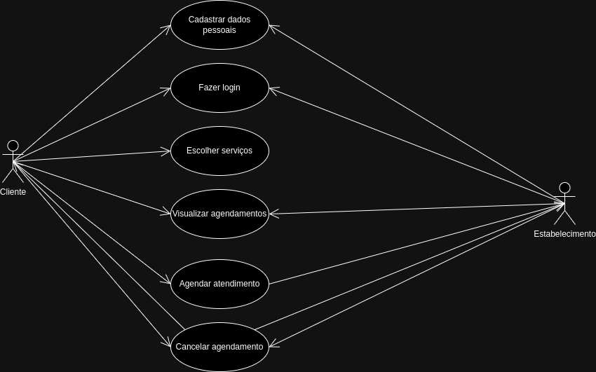

# Especificações do Projeto

Pré-requisitos: <a href="./01-Documentação de Contexto.md"> Documentação de Contexto</a>

Definição do problema e ideia de solução a partir da perspectiva do usuário. É composta pela definição do  diagrama de personas, histórias de usuários, requisitos funcionais e não funcionais além das restrições do projeto.

Apresente uma visão geral do que será abordado nesta parte do documento, enumerando as técnicas e/ou ferramentas utilizadas para realizar a especificações do projeto

## Personas

João, 32 anos, consultor de marketing ocupado e profissional. Valoriza eficiência e qualidade em seus compromissos. Busca uma barbearia com sistema de agendamento online para evitar esperas, serviços de alta qualidade e conveniência. Prefere tratamento personalizado e está disposto a pagar por isso. 

Ana, 25 anos, é uma advogada bem-sucedida e determinada, que se destaca em seu campo profissional. Ela se preocupa com sua aparência e gosta de manter um visual elegante e bem cuidado. Ana é uma cliente fiel quando encontra uma barbearia que atenda às suas necessidades e expectativas. Ela está disposta a pagar mais por um serviço de alta qualidade e valoriza a conveniência e a personalização.

Carlos, 44 anos, é um barbeiro talentoso e dedicado, apaixonado por seu ofício desde sempre. Ele trabalha em uma barbearia tradicional, onde ele é reconhecido por sua habilidade excepcional e atendimento amigável. Carlos está sempre em busca de maneiras de melhorar a experiência de seus clientes e tornar seu trabalho mais eficiente. Carlos é um profissional dedicado que se preocupa com a satisfação de seus clientes e está sempre em busca de maneiras de melhorar seu serviço. Ele está aberto a adotar novas tecnologias, como um sistema de agendamento online, desde que isso o ajude a aprimorar sua prática e oferecer um serviço de alta qualidade.

## Histórias de Usuários

Com base na análise das personas foram identificadas as seguintes histórias de usuários:

| EU COMO... `PERSONA` | QUERO/PRECISO... `FUNCIONALIDADE` | PARA... `MOTIVO/VALOR` |
| -------------------- | --------------------------------- | ---------------------- |
| Cliente | cadastrar no site | ter uma conta com as minhas informações |
| Cliente | logar no site | utilizar os serviços do mesmo |
| Cliente | visualizar os serviços oferecidos | selecionar o serviço desejado |
| Cliente | marcar/desmarcar horário no estabelecimento | encaixar no meu horário do dia a dia |
| Cliente | visualizar meus agendamentos | confirmar meus horários e serviços marcados |
| Estabelecimento | logar no site | utilizar os serviços do mesmo |
| Estabelecimento | desmarcar o horário de um cliente | o caso de não conseguir atender o cliente em determinado horário |
| Estabelecimento | visualizar os meus agendamentos | ter acesso a seus compromissos |

## Requisitos

As tabelas que se seguem apresentam os requisitos funcionais e não funcionais que detalham o escopo do projeto.

### Requisitos Funcionais

| ID | Descrição do Requisito | Prioridade |
| -- | ---------------------- | ---------- |
| RF-001 | A aplicação deve permitir ao cliente cadastrar uma conta. | ALTA |
| RF-002 | A aplicação deve permitir ao cliente fazer login na sua conta. | ALTA |
| RF-003 | A aplicação deve permitir ao cliente visualizar os estabelecimentos e seus serviços oferecidos. | ALTA |
| RF-004 | A aplicação deve permitir ao cliente escolher os serviços do estabelecimento. | ALTA |
| RF-005 | A aplicação deve permitir ao cliente visualizar os dias e horários disponíveis para atendimento. | ALTA |
| RF-006 | A aplicação deve permitir ao cliente agendar seu atendimento com o estabelecimento. | ALTA |
| RF-007 | A aplicação deve permitir ao estabelecimento fazer login na sua conta. | ALTA |
| RF-008 | A aplicação deve permitir ao estabelecimento visualizar informações de agendamentos dos clientes. | ALTA |
| RF-009 | A aplicação deve permitir ao estabelecimento cancelar agendamentos dos clientes. | MÉDIA |

> **Prioridade: Alta / Média / Baixa.

### Requisitos não Funcionais

| ID | Descrição do Requisito | Prioridade |
| -- | ---------------------- | ---------- |
| RNF-001 | Os usuários, devem poder navegar e interagir com a aplicação sem dificuldades. | ALTA | 
| RNF-002 | As páginas e funcionalidades devem ser carregadas de forma eficiente, proporcionando uma experiência sem atrasos. | ALTA | 
| RNF-003 | A aplicação deve estar sempre online, inclusive em finais de semana pois muitos estabelecimentos possuem seu pico de acesso no final de semana. | MÉDIA |
| RNF-004 | A aplicação deve ser projetada de forma a permitir o uso por pessoas com deficiências visuais, motoras ou auditivas, através de HTML semântico. | ALTA |
| RNF-005 | A aplicação deve ser projetada para todos os tipos de dispositivos, computador desktop, notebook, celular, tablet através da responsividade. | ALTA | 
| RNF-006 | A aplicação deve ser desenvolvida visando uma fácil manutenção e escalabilidade, para possibilitar uma fácil expansão da mesma. | MÉDIA |
| RNF-007 | As requisições dos usuários devem ter um tempo de resposta aceitável (de no máximo 5 segundos). | BAIXA |

> **Prioridade: Alta / Média / Baixa.

## Restrições

O projeto está restrito pelos itens apresentados na tabela a seguir.

| ID | Restrição |
| -- | --------- |
| 01 | O projeto deverá ser entregue até o final do semestre, não podendo extrapolar a data de 30/06/2024. |
| 02 | O projeto deve conter API. |
| 03 | O sistema deverá se conectar com o banco de dados MySQL. |
| 04 | O aplicativo deve ser construído no back-end através do CSharp. |
| 05 | O aplicativo deve ser construído no front-end através de tecnologias como HTML, CSS, JS, Bootstrap (opcional). |

## Diagrama de Casos de Uso

O diagrama de casos de uso foi feito utilizando o [**Diagrams**](https://app.diagrams.net/) e pode ser visualizado logo abaixo, juntamente com o link para visualização em tempo real do diagrama com suas futuras modificações:

> [`Link para o diagrama do caso de uso do projeto`](https://drive.google.com/file/d/1OFFpumQvdSRksNF-r7dSySezViTzgaEa/view?usp=sharing)
