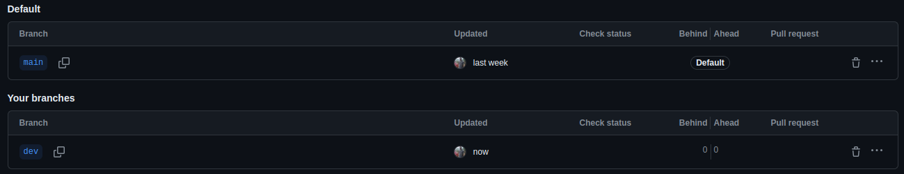
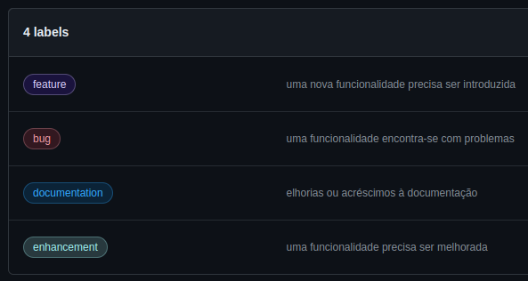
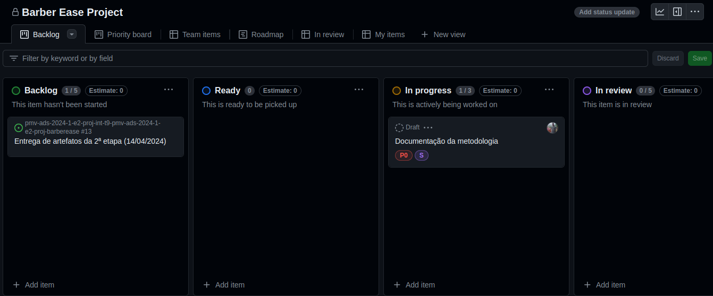

# Metodologia

Pré-requisitos: <a href="2-Especificação do Projeto.md"> Documentação de Especificação</a>

## Controle de Versão

A ferramenta de controle de versão adotada no projeto foi o
[Git](https://git-scm.com/), sendo que o [Github](https://github.com)
foi utilizado para hospedagem do repositório.

O projeto segue a seguinte convenção para o nome de branches:

- `main`: versão estável já testada do software
- `dev`: versão de desenvolvimento do software

Quanto à gerência de issues, o projeto adota a seguinte convenção para
etiquetas:

- `documentation`: melhorias ou acréscimos à documentação
- `bug`: uma funcionalidade encontra-se com problemas
- `enhancement`: uma funcionalidade precisa ser melhorada
- `feature`: uma nova funcionalidade precisa ser introduzida

## Gerenciamento de Projeto

A metodologia ágil escolhida para o desenvolvimento deste projeto foi o SCRUM, pois como citam Amaral, Fleury e Isoni (2019, p. 68), seus benefícios são a

“visão clara dos resultados a entregar; ritmo e disciplina necessários à execução; definição de papéis e responsabilidades dos integrantes do projeto (Scrum Owner, Scrum Master e Team); empoderamento dos membros da equipe de projetos para atingir o desafio; conhecimento distribuído e compartilhado de forma colaborativa; ambiência favorável para crítica às ideias e não às pessoas.”

### Divisão de Papéis

Desta forma, a equipe está organizada da seguinte maneira:

- Scrum Master: William Rodrigues
- Product Owner: Douglas Takemi Kimura
- Equipe de Desenvolvimento: William Rodrigues, Felipe Ferreira Machado, Pedro Henrique Chaves Dias, Sergio Golçalves da Silva Junior, Douglas Takemi Kimura, Moisés Santos
- Equipe de Design: William Rodrigues, Douglas Takemi Kimura

### Processo

Para organização e distribuição das tarefas do projeto, a equipe está utilizando o GitHub Projects, estruturado com as seguintes listas:

- Backlog: recebe as tarefas a serem trabalhadas e representa o Product Backlog. Todas as atividades identificadas no decorrer do projeto também são incorporadas a esta lista.
- Ready: esta lista representa o Sprint Backlog que está sendo trabalhado.
- In progress: lista das tarefas iniciadas.
- In review: lista das tarefas que foram desenvolvidas e estão em análise (code review e testes).
- Done: nesta lista são colocadas as tarefas finalizadas e as que passaram pelos testes e controle de qualidade, prontas para serem entregues aos usuários.

> O quadro do GitHub no formato **Kanban** está diponível [aqui](https://github.com/orgs/ICEI-PUC-Minas-PMV-ADS/projects/619) e é apresentado, no estado atual, na figura abaixo:

### Ferramentas

As ferramentas empregadas no projeto são:

- Editor de código ([VS Code](https://code.visualstudio.com/)).
- Ferramentas de comunicação ([Teams](https://www.microsoft.com/pt-br/microsoft-teams/log-in)).
- Ferramentas de desenho de tela ([Figma](https://www.figma.com/)).

O editor de código foi escolhido porque ele possui uma integração com o
sistema de versão. As ferramentas de comunicação utilizadas possuem
integração semelhante e por isso foram selecionadas. Por fim, para criar
diagramas utilizamos essa ferramenta por melhor captar as
necessidades da nossa solução.
