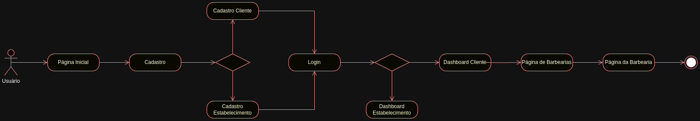

# Projeto de Interface

Pré-requisitos: <a href="2-Especificação do Projeto.md"> Documentação de Especificação</a>

Visão geral da interação do usuário pelas telas do sistema e protótipo interativo das telas com as funcionalidades que fazem parte do sistema (wireframes).

## Diagrama de Fluxo

O Fluxo de Usuário (User Flow) abaixo mostra o mapeamento do fluxo de navegação do usuário na aplicação entre as telas. Ela serve para alinhar os caminhos e as possíveis ações que o usuário pode fazer.

## Wireframes

Home Page

Crie sua Conta

Entrar

Barbearias

Barbearia

Carrinho

Assinatura

Anuncie Conosco

Os quadrados cinza escuro com bordas arrendondadas serão imagens, já os retangulos cinza claro serão formulários.
