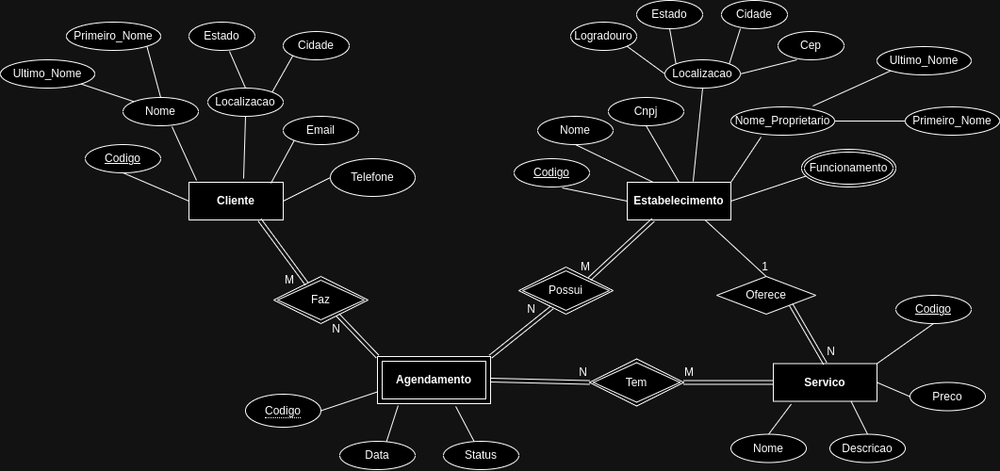
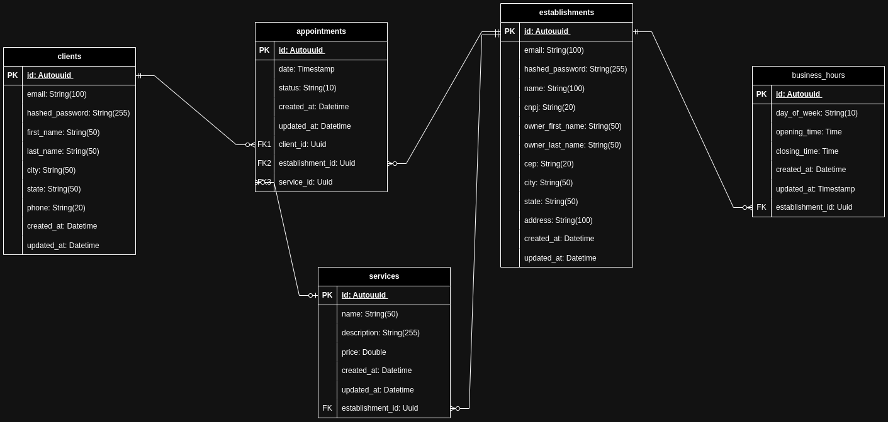

# Arquitetura da Solução

Pré-requisitos: <a href="3-Projeto de Interface.md"> Projeto de Interface</a>

Definição de como o software é estruturado em termos dos componentes que fazem parte da solução e do ambiente de hospedagem da aplicação.

## Diagrama de Classes

O diagrama de classes ilustra graficamente como será a estrutura do software, e como cada uma das classes da sua estrutura estarão interligadas. Essas classes servem de modelo para materializar os objetos que executarão na memória.

## Modelo ER (Projeto Conceitual)

O Modelo ER representa através de um diagrama como as entidades (coisas, objetos) se relacionam entre si na aplicação interativa.

## Projeto da Base de Dados

O projeto da base de dados corresponde à representação das entidades e relacionamentos identificadas no Modelo ER, no formato de tabelas, com colunas e chaves primárias/estrangeiras necessárias para representar corretamente as restrições de integridade.

## Tecnologias Utilizadas

### Tecnologias utilizadas no frontend

- JavaScript
- HTML
- CSS

### Tecnologias utilizadas no backend

- C#
- Framework .NET 8
- EntityFramework 8
- SQLite
- SQLServer
- Docker

### Tecnologias utilizadas para desenvolvimento

- VS Code
- DBeaver
- Postman

## Hospedagem

### Frontend

O frontend foi hospedado no próprio GitHub Pages, no seguinte link

- https://icei-puc-minas-pmv-ads.github.io/pmv-ads-2024-1-e2-proj-int-t9-pmv-ads-2024-1-e2-proj-barberease/

### Backend

O banco de dados foi hospedado no Azure Clound, com uma instância do **SQLServer**.

Igualmente o backend, foi hospedado em uma instância Docker para facilitar a troca de versões.
