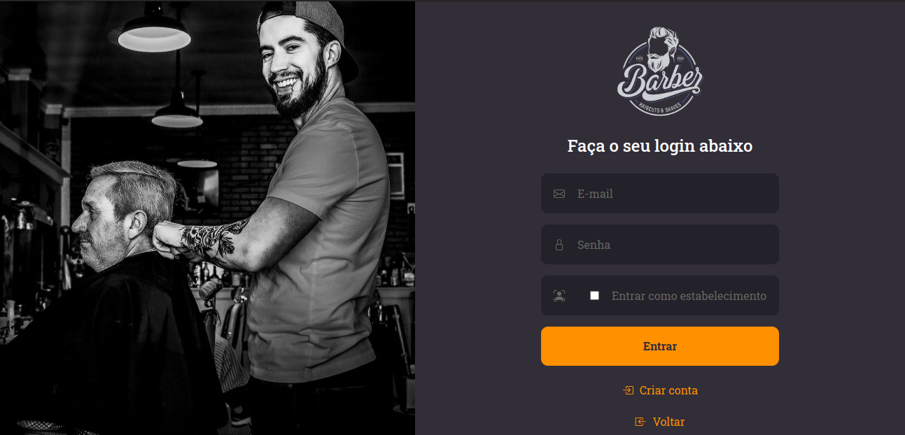
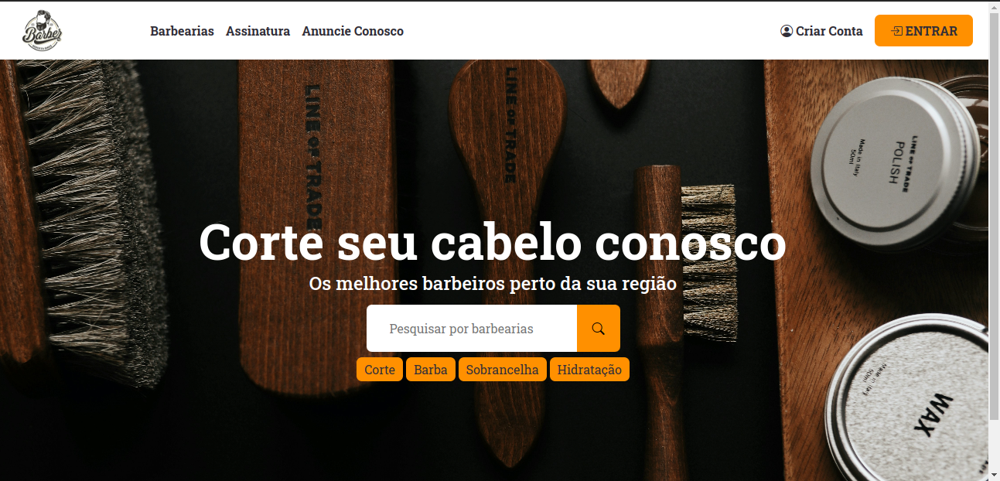
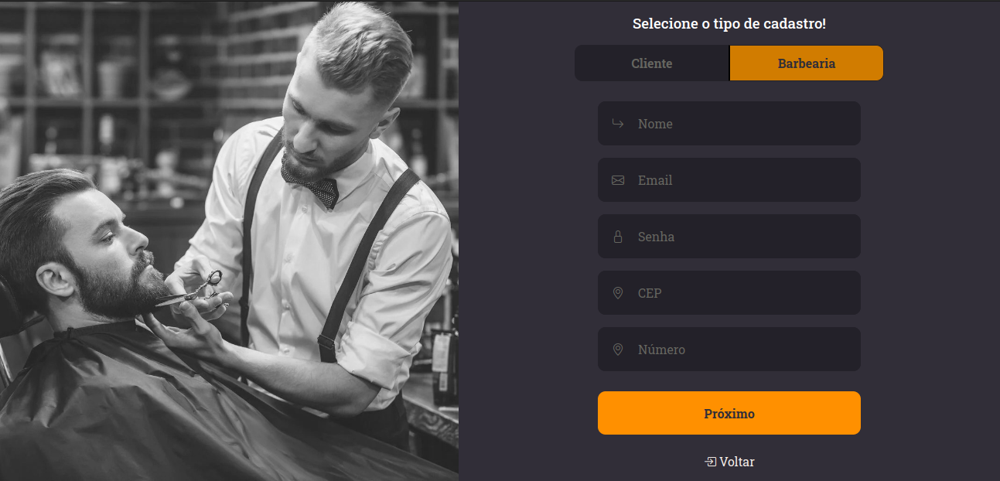
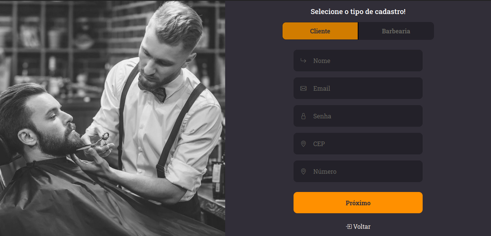

# Template Padrão da Aplicação
O layout padrão do site foi construído com as linguagens de marcação HTML e CSS, e a linguagem de programação JavaScript foi utilizada para a construção do menu responsivo.

As páginas terão como elementos padrões o menu de navegação e header, além dos elementos de identidade visual citados abaixo:

<ul>
    <li>Cores: #312E38, #ffffff, #ff9000, #d17c00;</li>
    <li>Font-family: Roboto Slab.</li>
    <li>Font-size: 20px. </li>
</ul>

<h3><b>Tela de login</b></h3>

Apresenta formulário e instruções para realizar login do cliente ou estabelecimento

<figure>
    
    <figcaption>Figura 1 - Página de login </figure>
</figure>

<h3><b>Tela de apresentação</b></h3>

Exibe uma breve informação sobre o intuito do site e orienta o uso do mesmo.

<figure>
    
    <figcaption>Figura 2 - Home page </figure>
</figure>

<h3><b>Tela de cadastro de Estabelecimento</b></h3>

Apresenta formulário e instruções para cadastro de estabelecimento.

<figure>
    
    <figcaption>Figura 3 - Cadastro Estabelecimento </figure>
</figure>

<h3><b>Tela de cadastro de cliente</b></h3>

Apresenta formulário e instruções para cadastro do cliente.

<figure>
    
    <figcaption>Figura 4 - Cadastro Cliente </figure>
</figure>
