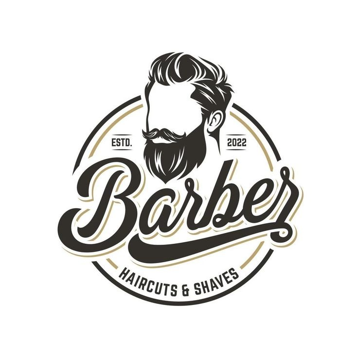

# Apresentação

[Apresentação do projeto (slides)](https://github.com/user-attachments/files/15949029/barber.Ease.14.03.2024.pdf)

## Título do Projeto
**pmv-ads-2024-1-e2-proj-int-t9-pmv-ads-2024-1-e2-proj-barberease**

  

## Nome/Marca da Aplicação
**Barber Ease - Barbearia Moderna**

  
## Símbolo ou logo da Aplicação
<figure>
    
    <figcaption>Figura 1 - Logo </figure>
</figure>

